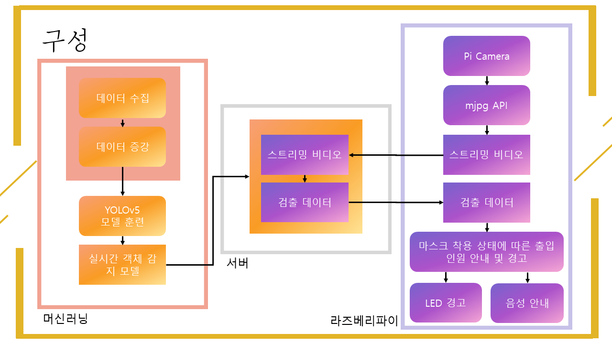
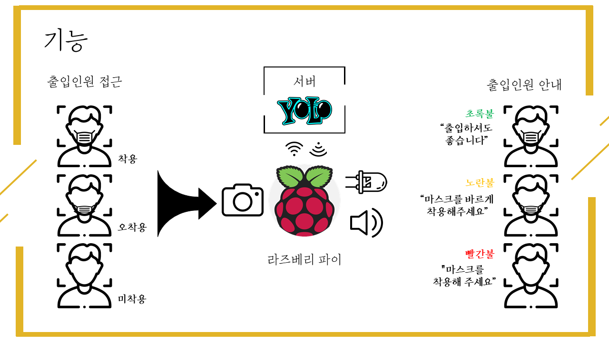

YOLOv5와 Raspberry Pi를 사용한 마스크 감지 및 경고 프로그램
===

## Introduce
실시간 영상을 고성능 PC로 송출한 뒤 실시간 객체 감지 모델로 마스크 착용 유무를 검출하여 출입 인원 경고

## 개발동기
코로나 시대, 안전 수칙 준수 감시를 위한 사회적 비용이 증가하고 있는데 이를 줄이기 위해서 프로젝트를 진행했다

## 구성
- YOLOv5
- Raspberry Pi

</img>

## 기능
</img>

### 실행 방법
1. 라즈베리파이에서 mjpg-streamer 실행한 뒤, 터미널에서 sh mjpg.sh 입력
2. 라즈베리파이에서 comm_alert.py 실행 
3. PC에서 detect.py 실행 터미널에서 python ./yolov5/detect.py --weights withAugmentation_e150.pt --conf 0.4 --source http://[IP주소]:[PORT]/?action=stream 입력

***
#### 구현 영상 및 참고
https://www.notion.so/YOLOv5-Raspberry-Pi-698f3a2fd2e14318b7faef414bb6a885